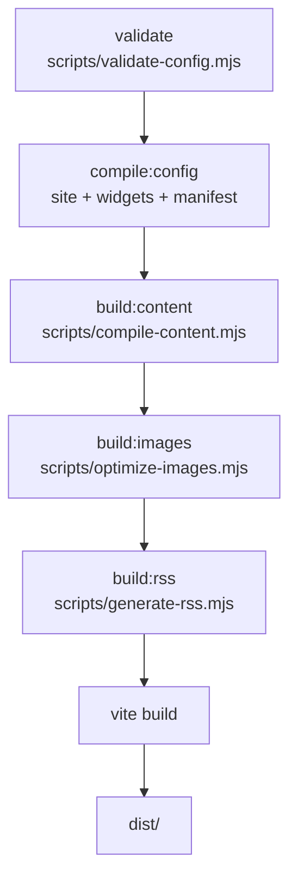

# 构建流水线详解

`pnpm run build` 通过 `prebuild` 钩子按固定顺序执行五个脚本，最后交给 Vite。本页逐段说明每一步读什么、写什么，便于排查构建问题或扩展脚本。



## 各阶段输入与输出

| 阶段 | 脚本 | 输入 | 输出 |
| :--- | :--- | :--- | :--- |
| `validate` | `validate-config.mjs` | `config/site.yaml`、`config/widgets.yaml`、`schemas/*.schema.json` | 校验不通过直接退出构建 |
| `compile:site` | `compile-site-config.mjs` | `config/site.yaml` | `public/generated/site-config.json`、`public/generated/palette.css` |
| `compile:widgets` | `compile-widgets-config.mjs` | `config/widgets.yaml` | `public/generated/widgets-config.json` |
| `compile:manifest` | `generate-manifest.mjs` | `config/site.yaml` | `public/manifest.json`（PWA） |
| `build:content` | `compile-content.mjs` | `config/subscriptions.yaml`、`content/card/**`、`content/conclusion/**` | `public/generated/content-data.json`、`public/generated/search-index.json` |
| `build:images` | `optimize-images.mjs` | `content/card/covers/`、`content/img/` 中被引用的 `/covers/*`、`/img/init-*` 资源 | 优化后的图片写入 `public/` 对应路径（Sharp，未安装时降级跳过） |
| `build:rss` | `generate-rss.mjs` | `content-data.json` | `public/rss.xml`（全站）+ `public/rss/<school_slug>.xml`（按单位） |
| `build` | `vite build` | 以上全部 + 前端源码 | `dist/` |

补充说明：

- **`validate` 不校验 `subscriptions.yaml`**。它的结构错误会在 `build:content` 阶段才暴露（如 `schools` 为空数组直接报错）。
- `compile:config` 是 `compile:site` + `compile:widgets` + `compile:manifest` 三者的组合命令。
- `compile-content.mjs` 写 JSON 时先写 `.tmp` 临时文件再原子替换，避免 dev 模式下读到半截文件。
- Vite 构建阶段还会执行 `vite.config.ts` 中的 `siteConfigHtmlPlugin`，替换 `index.html` 里的 `{{SITE_NAME}}`、`{{THEME_COLOR}}` 等占位符。
- 所有生成物（`public/generated/**`、`public/manifest.json`、`public/rss*`、`dist/`）均已 `.gitignore`，**不要手改、不要提交**。

## 卡片如何变成页面数据

`compile-content.mjs` 是流水线的核心：

1. 读取 `config/subscriptions.yaml`，建立 `categories` 枚举与 `school → subscriptions` 结构，并为每个学院自动补一条「未知来源」兜底订阅。
2. 用 gray-matter 解析 `content/card/<school_slug>/*.md` 的 frontmatter 与正文（marked 渲染）。
3. 推导 `subscription_id = school_slug + source.channel`；非法 `school_slug` 回退 `unknown`，匹配不到订阅的 `channel` 回退 `{school_slug}-未知来源`。
4. 汇总每日摘要（`content/conclusion/`），输出 `content-data.json` 与轻量的 `search-index.json`（前端全文搜索用）。

卡片 frontmatter 的字段规则见 [YAML 格式及含义](/use/format)，生产侧约束见仓库根目录 `BOT_RULES.md` 第 5 节。

## 辅助脚本（不在流水线内）

`scripts/` 下还有一些按需手动执行的工具：

| 脚本 | 用途 |
| :--- | :--- |
| `upload-large-attachments.mjs` | 将超过 `ATTACHMENT_UPLOAD_THRESHOLD_MB` 的附件上传到 S3 兼容存储并替换引用（未配置 S3 时静默跳过） |
| `sync-media-to-s3.mjs` | 批量同步媒体资源到对象存储 |
| `backfill-attachments.mjs` | 历史附件路径回填 |
| `generate-demo-content.mjs` / `generate-sample-content.mjs` | 生成演示/样例卡片 |
| `migrate-views-schema.sql` | D1 浏览量表结构迁移 |

## Cloudflare Functions 本地调试

浏览量 API 位于 `functions/api/view.ts` 与 `functions/api/views.ts`，存储层是 `functions/lib/view-store.ts` 的 `ViewStore` 接口（内置 D1 实现，可自行扩展 PostgreSQL/MySQL 等）。

本地调试：

```bash
pnpm run build
npx wrangler pages dev dist    # 在 8788 端口提供 /api
pnpm run dev                   # Vite 将 /api 代理到 8788
```

不起 Wrangler 时前端静默降级为不计数模式，属正常现象。

## 测试

项目使用 Node 内置的 `node:test`，无额外测试框架：

```bash
node --test tests/theme-vars.test.mjs
```

新增脚本或工具函数时，建议在 `tests/` 下添加同风格的 `*.test.mjs`。

## 发布

构建产物 `dist/` 的部署方式（Cloudflare Pages / GitHub Actions / 其它平台）见[手动部署](/intro/deploy-manual#_4-阶段三-发布站点)，此处不再重复。
