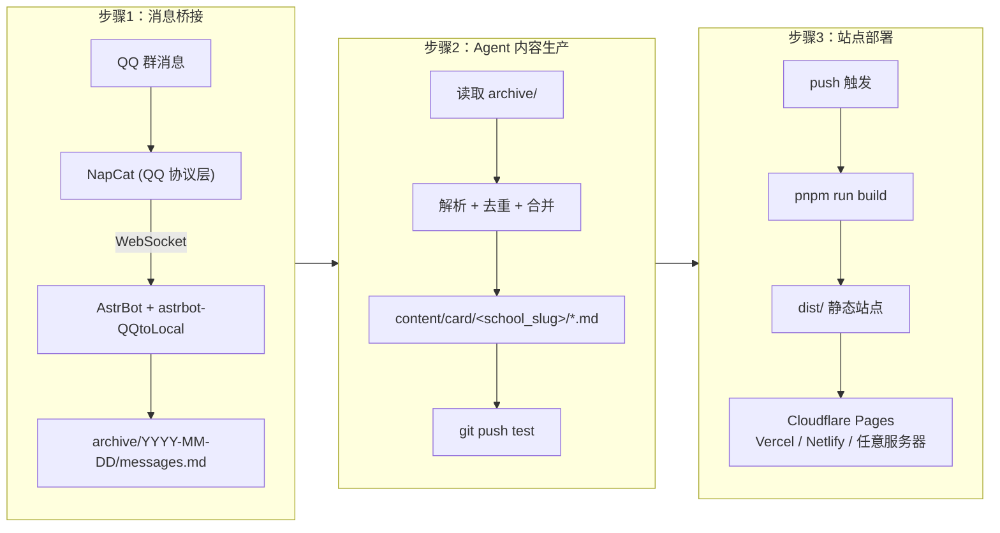
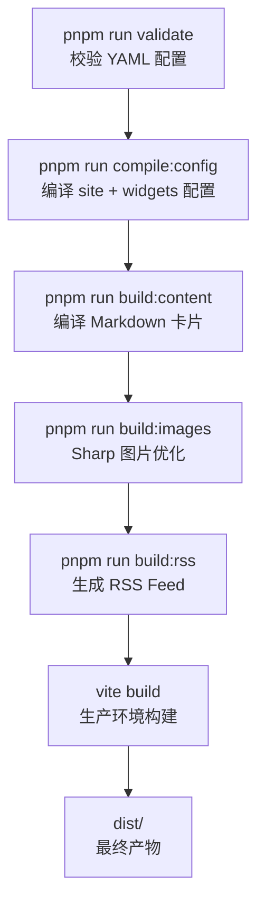

# 整体架构

EDU-PUBLISH 采用三段式独立架构，各模块相互解耦，可以根据需求灵活选择运行。

## 架构流程图



## 各阶段职责

### 步骤 1：消息桥接

将 QQ 协议的消息落盘为本地文件。

- **NapCat**: QQ 协议层，以 Docker 容器运行，通过反向 WebSocket 将消息转发给 AstrBot
- **AstrBot**: 机器人框架，加载 `astrbot-QQtoLocal` 插件，将接收到的群消息写入 `archive/YYYY-MM-DD/messages.md`
- **archive/**: Git 子模块，独立管理消息归档，对 Agent 只读

::: info 目录结构
```
archive/
  └── 2026-04-13/
      └── messages.md    # 当日所有群消息的原始记录
```
:::

### 步骤 2：Agent 内容生产

读取本地归档，利用 AI 自动生成结构化的 Markdown 卡片。

- Agent 读取 `archive/` 中的新消息，按 `subscriptions.yaml` 中的学院/部门定义进行来源映射
- 对消息进行解析、去重、合并，生成两阶段卡片（脚本模板 + LLM 语义填充）
- 输出到 `content/card/<school_slug>/` 目录，每张卡片带有 YAML frontmatter
- 验证通过后推送到 `test` 分支（不允许直接推送 `main`）

Agent 的行为受 `BOT_RULES.md` 严格约束：
- **写入范围**: 仅限 `content/**/*.md` 和 `worklog/**/*.md`
- **禁止操作**: 不得修改配置文件、代码、归档数据
- **必须执行**: 推送前运行 `pnpm run validate` 校验

### 步骤 3：站点部署

将生成的 Markdown 内容构建并发布为静态站点。

- `pnpm run build` 触发完整的构建流水线：配置校验 → 配置编译 → 内容编译 → 图片优化 → RSS 生成 → Vite 构建
- 输出 `dist/` 目录，可部署到任何静态托管平台

## 项目目录结构

```
EDU-PUBLISH/
├── .agent/              # Agent 部署引导文档 (SETUP / PUBLISH / SKILLS)
├── .github/workflows/   # GitHub Actions (deploy.yml / deploy-main.yml)
├── archive/             # Git 子模块，QQ 消息归档 (只读)
├── components/          # React 组件
│   ├── ui/              # shadcn/ui 基础组件
│   └── widgets/         # 功能组件 (日历、看板等)
├── config/              # YAML 配置文件
│   ├── site.yaml        # 站点基础信息
│   ├── subscriptions.yaml  # 学院/分类定义
│   └── widgets.yaml     # 功能开关
├── content/             # Agent 生成的内容
│   ├── card/            # 通知卡片 (按 school_slug 分目录)
│   └── conclusion/      # 每日摘要
├── functions/           # Cloudflare Functions (API)
├── hooks/               # React Hooks
├── lib/                 # 工具库
├── schemas/             # JSON Schema 校验文件
├── scripts/             # 构建脚本 (编译/校验/优化/RSS)
├── services/            # 服务层
├── public/              # 静态资源
├── worklog/             # Agent 工作日志
├── BOT_RULES.md         # Agent 行为规则 (12 项约束)
└── wrangler.toml        # Cloudflare Pages 配置
```

## 构建流水线

`pnpm run build` 的完整执行流程：


