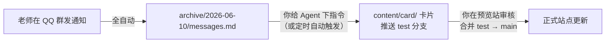

# 使用说明书

本页面向**部署完成后的日常使用者**（比如负责转发通知的班委）。读完你会知道：消息是怎么从 QQ 群一路变成网站卡片的、你需要在哪几个环节动手、以及如何把动手的环节也自动化掉。

::: tip 站点还是"示例大学"？
如果你还没把站名、学院列表改成自己学校的，先读[客制化你的站点](/use/customize)——推荐直接让 AI 帮你改配置。
:::

全文用一个贯穿的实例来讲解：

> **场景**：班委小王已经按[部署文档](/intro/deploy-manual)搭好了系统，监听 QQ 群「信工学院通知群」（群号 `123456789`）。今天上午辅导员在群里发了一条暑期实习报名通知。

## 日常工作流总览



三个箭头对应三种参与度：第一步完全不用管；第二步默认需要你说一句话（本页最后会教你把它也自动化）；第三步是唯一建议保留人工的环节——发布前审核。

## 第 1 步：消息自动进入归档（无需操作）

只要 Docker 里的 NapCat + AstrBot 在运行，且AstrBot-toloacal插件配置正确，指定监听的群消息就会自动落盘。辅导员再qq群发完通知后


`archive/2026-06-10/messages.md` 里会多出这样一段：

```md
## 2026-06-10 09:15:32
- 来源群: `信工学院通知群` (`123456789`)
- 发送者: `辅导员张老师` (`10001`)
- 消息ID: `45678`

各位同学：2026 年暑期实习报名现已开启，面向大二、大三全体同学。
请填写附件报名表，于 6 月 20 日 17:00 前提交至辅导员处。

附件:
- 文件: [报名表.docx](files/3fa2c1_报名表.docx)

---
```

附件和图片会分别下载到当日目录的 `files/` 和 `photos/` 子目录。

::: tip 不想被归档的消息
群里的闲聊不用担心——Agent 整理时只会把"像通知"的内容做成卡片。如果想**明确**让某条消息被跳过，可以让发送者在消息前加上插件配置的忽略前缀，归档时该消息会被标记为 `[ignore]`，Agent 会整条跳过。
:::

平时可以用这两条命令确认链路活着：

```bash
docker compose ps                              # 两个容器都应为 Up
ls archive/$(date +%Y-%m-%d)/                  # 今天的归档目录
```

## 第 2 步：让 Agent 整理归档、生成卡片

这是系统的核心环节：你在项目根目录启动任意一个 AI Agent（Claude Code、Codex、Hermes、OpenClaw 接管的 agent 等都可以），给它下一句指令，它会把新归档变成网站卡片。

### 2.1 下指令

以 Claude Code 为例（其它 Agent 同理，输入框里说同样的话）：

```bash
cd EDU-PUBLISH
claude
```

然后输入：

```text
按 skills/edup-incremental-process 的流程，增量处理 archive/ 中尚未处理的归档，
生成卡片和每日摘要，校验通过后推送到 test 分支，最后按固定模板回报。
```
或者简单直接一点：
```text
看看 archive，开始干活
```

::: info 第一次使用？
如果项目根目录还没有 `skills/` 目录（部署时跳过了 skill 安装），先让 Agent「阅读 .agent/SKILLS.md 并安装所需 skills」。8 个 `edup-*` skill 是 Agent 干活的标准作业流程。
:::

### 2.2 Agent 会做什么

Agent 的行为受仓库根目录的 `BOT_RULES.md` 严格约束，一次标准处理包括：

1. **对账**：比对 `archive/` 日期目录与已处理记录，找出新消息。
2. **解析与合并**：同一 `消息ID` 的多段消息（正文 + 附件分开发的情况）合并成一个通知单元；跳过 `[ignore]`、空消息、纯表情。
3. **来源映射**：按「群名 → 群号 → 发送者 → 正文关键词」的顺序，把消息归到 `config/subscriptions.yaml` 里定义的某个学院/订阅源；认不出的进 `未知来源` 兜底。
4. **去重与补充合并**：和 `content/card/` 里已有卡片比对，重复的跳过；识别出「补充通知 / 更正」会并入原卡片而不是新建。
5. **生成卡片**：写入 `content/card/<school_slug>/`，附件复制到 `content/attachments/`、图片复制到 `content/img/`。
6. **每日摘要与工作日志**：更新 `content/conclusion/<school_slug>.md` 和 `worklog/YYYY-MM-DD.md`。
7. **校验与推送**：跑 `pnpm run validate`，通过后提交并推送 **`test` 分支**（规则禁止它碰 `main`），最后向你回报新增了哪些卡片、有哪些没认出来源。

### 2.3 实例：这条通知变成了什么

上面那条实习通知，Agent 会生成类似 `content/card/info-engineering/2026-06-10-summer-internship.md`：

```yaml
---
id: 2026-06-10-info-engineering-summer-internship
school_slug: info-engineering
title: 2026 暑期实习报名启动，6 月 20 日截止
description: >-
  信息工程学院面向大二、大三同学开启 2026 年暑期实习报名，
  需填写报名表并于 6 月 20 日 17:00 前提交至辅导员处。
published: '2026-06-10T09:15:32+08:00'
category: 志愿实习
tags:
  - 实习
  - 报名
start_at: '2026-06-10T09:15:32+08:00'
end_at: '2026-06-20T17:00:00+08:00'
source:
  channel: 学院通知
  sender: 辅导员张老师
attachments:
  - name: 报名表.docx
    url: /attachments/报名表.docx
---

各位同学：2026 年暑期实习报名现已开启，面向大二、大三全体同学。
请填写附件报名表，于 6 月 20 日 17:00 前提交至辅导员处。
```

几个值得注意的点（完整字段规则见 [YAML 格式及含义](/use/format)）：

- 标题和摘要是 LLM 重写的，比原通知伪人标题更可读，但事实不变。
- 这是"报名收集型"通知，所以 `end_at` 取的是**报名截止时间**，网站日历和"进行中活动"统计都靠它。
- `来源群: 信工学院通知群` 被映射成了 `subscriptions.yaml` 里 `info-engineering` 学院的「学院通知」订阅源。

想本地确认效果，跑 `pnpm run dev` 打开 `http://localhost:3000`，卡片已经出现在信工学院的列表、日历和今日摘要里。


## 第 3 步：审核与发布

Agent 推送 `test` 分支后：

- **Cloudflare Pages Git 直连**用户：`test` 分支自动生成预览部署，打开预览 URL 检查卡片内容。
- 确认无误后，**跟agent直接说审核无误**，在 GitHub 上发起 `test → main` 的 Pull Request 并合并（或本地 merge 后 push `main`——`main` 的变更只应由人工触发）。
- `main` 更新会触发正式站点的构建部署，几分钟后全校同学就能在网站、RSS、PWA 里看到这条通知。

到这里，一条通知的完整生命周期就走完了。日常使用中你要做的只有两件事：**给 Agent 下指令** 和 **审核合并**。接下来两节把第一件事也自动化掉。

## 进阶一：远程控制你的 Agent

Agent 和 Docker 跑在同一台常开机器上（家里的旧电脑、实验室主机、VPS 都行）时，你不必坐在那台机器前——可以从手机聊天软件里给它下指令。以下四种主流方案任选其一，**请以各家官方文档为准**：

### 方案 A：OpenClaw（聊天平台 ↔ 本机 Agent 网关）

[OpenClaw](https://docs.openclaw.ai/) 是一个自托管网关，把 Telegram、WhatsApp、Discord、Slack 等聊天平台接到你机器上的 AI Agent。装在跑 EDU-PUBLISH 的机器上后，你在 Telegram 里发的话会被转给本机 Agent 在项目目录里执行。

以 Telegram 为例的最小配置（详见官方 [Telegram 频道文档](https://docs.openclaw.ai/channels/telegram)与[频道配置参考](https://docs.openclaw.ai/gateway/config-channels)）：

1. 在 Telegram 找 @BotFather 发送 `/newbot` 创建机器人，拿到 token。
2. 配置并启动网关：

   ```bash
   openclaw config set channels.telegram.botToken "<你的TOKEN>"
   openclaw config set channels.telegram.enabled true
   # 重启网关使配置生效
   ```

3. 在 Telegram 里给你的 bot 发消息，按默认的配对（pairing）策略批准自己：

   ```bash
   openclaw pairing approve telegram <配对码>
   ```

之后在手机上发「处理一下今天的归档并推送 test」，Agent 就会在服务器上开工。项目 `.env.example` 中的 `OPENCLAW_WORKSPACE` 即用于指定 OpenClaw 的工作目录指向 EDU-PUBLISH 项目。

### 方案 B：Hermes（自带 20+ 平台消息网关的 Agent）

[Hermes Agent](https://hermes-agent.nousresearch.com/docs/)（Nous Research 出品）本身就是常驻服务器的个人 Agent，内置消息网关，支持 Telegram、Discord、Slack、WhatsApp、Signal、Matrix 等 20+ 平台，还自带 cron 定时自动化——等于"Agent + 远程控制 + 定时器"一体。

```bash
curl -fsSL https://hermes-agent.nousresearch.com/install.sh | bash
hermes setup        # 配置模型与工具
hermes gateway      # 启动消息网关，绑定你的聊天账号
```

绑定后在聊天平台里直接对它说处理指令即可。安装与平台接入细节见官方 [Quickstart](https://hermes-agent.nousresearch.com/docs/getting-started/quickstart/) 与 [GitHub 仓库](https://github.com/NousResearch/hermes-agent)。

### 方案 C：Claude Code 无头模式 + SSH / 定时任务

[Claude Code](https://code.claude.com/docs/) 支持非交互的"无头模式"（`claude -p`），适合脚本与远程触发（官方文档：[Run Claude Code programmatically](https://code.claude.com/docs/en/headless)）：

```bash
ssh user@server 'cd /opt/EDU-PUBLISH && claude -p \
  "按 skills/edup-incremental-process 增量处理新归档，校验后推送 test 分支" \
  --allowedTools "Read,Glob,Grep,Edit,Write,Bash"'
```

`--allowedTools` 用于预授权工具、避免运行中途卡在确认上；还可加 `--output-format json` 拿到结构化结果。

### 方案 D：Codex 非交互模式

[OpenAI Codex CLI](https://developers.openai.com/codex/) 的 `codex exec` 子命令同样支持脚本化运行（官方文档：[Non-interactive mode](https://developers.openai.com/codex/noninteractive)）：

```bash
cd /opt/EDU-PUBLISH && codex exec --sandbox workspace-write \
  "按 skills/edup-incremental-process 增量处理新归档，校验后推送 test 分支"
```

运行进度走 stderr，最终结果走 stdout，方便重定向到日志。

::: warning 安全提醒
- 聊天网关类方案（OpenClaw / Hermes）务必启用配对或白名单（如 OpenClaw 的 `dmPolicy` / `allowFrom`），不要让任意人能指挥你的 Agent。
- Bot token、API key 不要提交进仓库；远程方案给 Agent 的权限以"够用"为限。
:::

## 进阶二：用 Hook 与定时任务做全自动化

把「下指令」这一步也省掉，常见三种做法，可叠加使用。

### 定时增量处理（cron）

最简单可靠：每半小时让无头 Agent 跑一轮增量处理。`crontab -e` 添加（以 Claude Code 为例，换成上面方案 D 的 `codex exec` 命令同理）：

```bash
# 每天 8:00–22:00，每 30 分钟处理一次新归档
*/30 8-22 * * * cd /opt/EDU-PUBLISH && claude -p "按 skills/edup-incremental-process 增量处理 archive/ 中的新归档，无新内容则直接退出；有新内容时校验通过后推送 test 分支" --allowedTools "Read,Glob,Grep,Edit,Write,Bash" >> ~/edup-agent.log 2>&1
```

`BOT_RULES.md` 建议增量提交采用"事件触发 + 最短间隔"（3~10 分钟以上的节流），30 分钟对校园通知场景绰绰有余。Hermes 用户可以不用系统 cron，直接使用其内置的定时自动化（见 [Hermes 文档](https://hermes-agent.nousresearch.com/docs/)）。

### Claude Code Hooks（在 Agent 生命周期上挂钩子）

Claude Code 的 [Hooks](https://code.claude.com/docs/en/hooks-guide) 是在固定生命周期节点**确定性执行**的 shell 命令——不依赖模型"记得"去做。两个对本项目实用的例子，写入项目的 `.claude/settings.json`：

**例 1：Agent 每次改完内容文件，强制跑校验**（用 `PostToolUse` 事件，匹配文件编辑类工具）：

```json
{
  "hooks": {
    "PostToolUse": [
      {
        "matcher": "Edit|Write",
        "hooks": [
          { "type": "command", "command": "pnpm run validate" }
        ]
      }
    ]
  }
}
```

**例 2：Agent 完成一轮处理后通知你**（用 `Stop` 事件，把命令换成你喜欢的通知方式，如 ntfy / Server酱 / Telegram Bot API）：

```json
{
  "hooks": {
    "Stop": [
      {
        "hooks": [
          { "type": "command", "command": "curl -s -d 'EDU-PUBLISH 处理完成，去预览站审核' ntfy.sh/<你的主题>" }
        ]
      }
    ]
  }
}
```

完整事件列表（`PreToolUse`、`PostToolUse`、`Stop`、`SessionStart` 等）、输入输出 JSON 格式见官方 [Hooks 参考](https://code.claude.com/docs/en/hooks)。Codex 的等价机制是在 `config.toml` 中配置（见 [Codex 配置参考](https://developers.openai.com/codex/config-reference)）。

### 文件监听触发（事件驱动）

如果想要"消息一落盘就处理"而不是定时轮询，可以用 `inotifywait` 监听归档目录（Linux；记得自己做节流）：

```bash
#!/usr/bin/env bash
# watch-archive.sh — archive/ 有新写入后等 5 分钟再触发一轮处理
while inotifywait -r -e close_write,create archive/; do
  sleep 300
  cd /opt/EDU-PUBLISH && claude -p "按 skills/edup-incremental-process 增量处理新归档，校验后推送 test 分支" \
    --allowedTools "Read,Glob,Grep,Edit,Write,Bash" >> ~/edup-agent.log 2>&1
done
```

配合第 3 步的 Cloudflare Pages 预览部署，最终形态是：**老师发通知 → 几分钟后预览站自动更新 → 你手机收到通知 → 点开审核 → 合并上线**。

## 日常维护速查

| 想做什么 | 命令 |
| :--- | :--- |
| 看桥接服务状态 | `docker compose ps` |
| 看实时日志 | `docker compose logs -f` |
| 重启桥接服务 | `docker compose restart` |
| 更新镜像 | `docker compose pull && docker compose up -d` |
| 看今天的归档 | `ls archive/$(date +%Y-%m-%d)/` |
| 看 Agent 工作日志 | `cat worklog/$(date +%Y-%m-%d).md` |
| 本地预览站点 | `pnpm run dev` |
| 手动校验配置 | `pnpm run validate` |

## 官方文档索引

为避免以讹传讹，各工具的用法请始终以官方文档为准：

| 工具 | 官方文档 | 本项目中的角色 |
| :--- | :--- | :--- |
| Claude Code | <https://code.claude.com/docs/> | 内容生产 Agent；[无头模式](https://code.claude.com/docs/en/headless)、[Hooks](https://code.claude.com/docs/en/hooks-guide) |
| OpenAI Codex | <https://developers.openai.com/codex/> | 内容生产 Agent；[非交互模式](https://developers.openai.com/codex/noninteractive) |
| Hermes Agent | <https://hermes-agent.nousresearch.com/docs/> | 内容生产 Agent + 消息网关 + 定时自动化 |
| OpenClaw | <https://docs.openclaw.ai/> | 聊天平台 ↔ 本机 Agent 的远程控制网关 |
| NapCat | <https://napneko.github.io/> | QQ 协议层 |
| AstrBot | <https://astrbot.app/> | 机器人框架（承载归档插件） |
| astrbot-QQtoLocal | <https://github.com/guiguisocute/astrbot-QQtoLocal> | QQ 消息 → 本地归档插件 |
